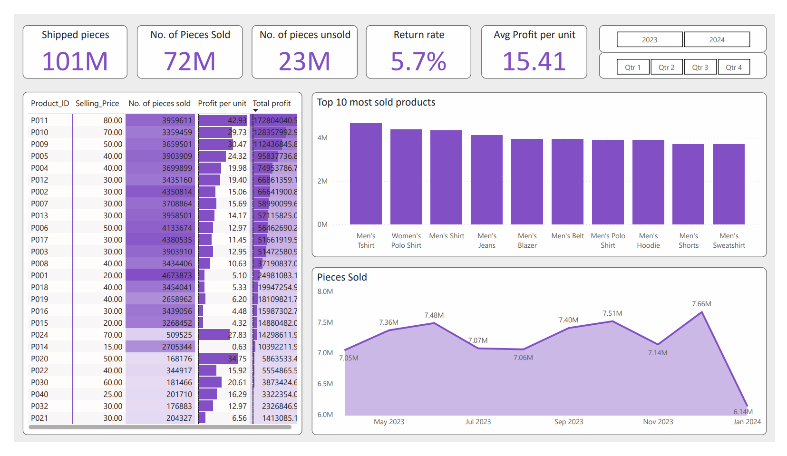
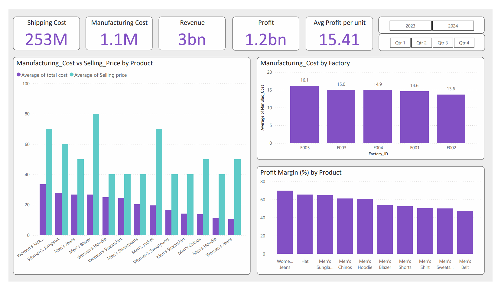
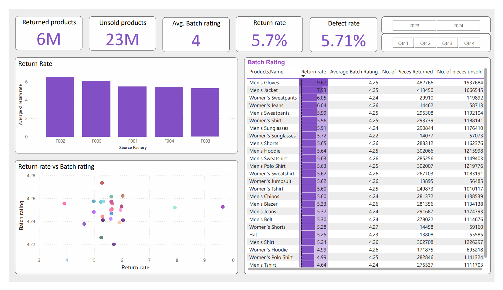

# 📊 Supply-Chain-Analysis (Power BI)

## Overview

This Power BI project delivers a comprehensive **supply chain analysis** for an apparel and fashion products business. It explores end-to-end performance across product sales, inventory, shipping, manufacturing costs, returns, and defect rates, providing actionable insights to optimize the supply chain and improve overall efficiency.

---

## 📦 Key Metrics Analyzed

- **Shipped Pieces**: Total products shipped  
- **Sold Pieces**: Number of products successfully sold  
- **Unsold Pieces**: Products remaining in inventory  
- **Return Rate**: Percentage of products returned  
- **Defect Rate**: Percentage of defective products  
- **Average Profit per Unit**  
- **Total Shipping Costs**  
- **Total Manufacturing Costs**  
- **Overall Revenue and Profit**  

---

## 📈 Dashboard Features

- **Performance Overview**  
  - Visual summary of shipped, sold, and unsold products  
  - Top 10 selling products  
  - Monthly sales trend  

- **Cost & Profitability**  
  - Manufacturing cost vs. selling price comparisons  
  - Profit margins by product  
  - Shipping and manufacturing cost tracking  
  - Factory-level manufacturing cost analysis  

- **Quality & Efficiency**  
  - Return rate by factory  
  - Defect rate trends  
  - Relationship between batch ratings and return rates  
  - Product-level returns and unsold inventory  

---

## 🗂️ Data Sources

- `data/Warehouse Shipping Costs.csv`  
- `data/Production Costs.csv`  
- `data/Log Data.csv`

These datasets capture shipping records, production costs, and transactional sales/returns data.

---

## 🛠️ Tools Used

- **Power BI Desktop**  
  - Data modeling  
  - Interactive dashboards  
  - DAX calculations  
- **Microsoft Excel** (for initial data cleaning)

---

## 📌 Insights Highlighted

- Identification of high-return-rate products for quality improvements  
- Tracking of top-selling vs. slow-moving inventory  
- Profitability analysis across product categories  
- Factory-level cost drivers and shipping cost patterns  
- Sales and return patterns to support demand forecasting

---

## 📎 Screenshots

| Performance Overview | Cost & Profitability | Quality & Efficiency |
|----------------------|----------------------|----------------------|
|  |  |  |

---

---

